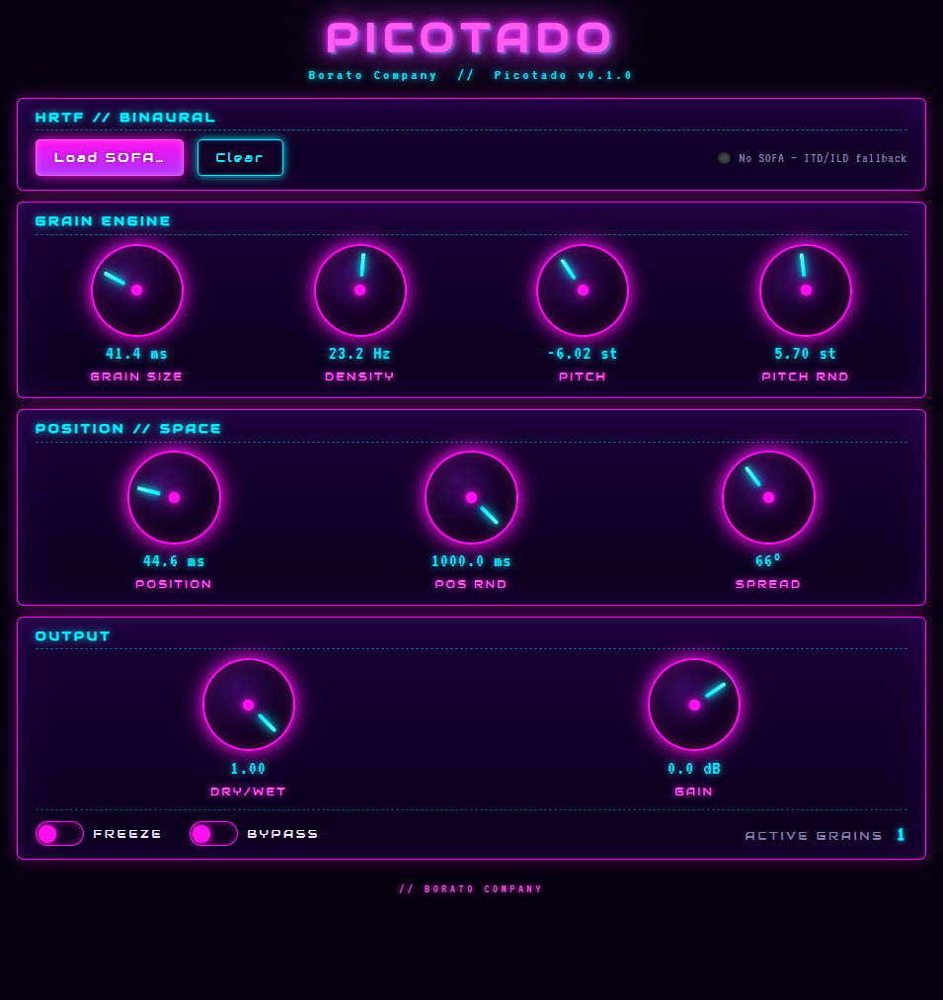

# Picotado

> *Granular synth: per-grain binaural HRTF, JUCE 8, WebView synthwave UI.*

<p align="center">
  
</p>

Picotado is a real-time granular synthesizer plugin with true
binaural spatialization. Most granulators pan grains across a flat
stereo field — Picotado convolves every grain against an HRTF
impulse response (any SOFA file you drop in) so each one is placed
at its own position in 3D space, around the listener's head. Feed
it a sustained source and you get a cloud of micro-events scattered
through the binaural sphere.

Built on JUCE 8, libmysofa, and a WebView UI in full synthwave gear.
Free-flow density (no MIDI), live input only, fixed-pool grain
engine that pre-allocates everything for predictable real-time
performance. CMake build with one-shot release script for VST3 +
Standalone on Windows.

## TL;DR

Os comandos. Em ordem.

```cmd
::  Primeira vez (uma vez só, instala WebView2 NuGet):
scripts\setup.cmd

::  Pra ter o VST3 funcionando no DAW (Release + instala):
scripts\release.cmd

::  Pra desenvolver (Debug + abre standalone):
scripts\build.cmd
scripts\run.cmd
```

`scripts\release.cmd` faz **build Release + copia o VST3** pra
`%LOCALAPPDATA%\Programs\Common\VST3\Picotado.vst3`. Depois é só
rescanear os plug-ins no DAW.

## Todos os scripts

| Script                          | O que faz                                                |
| ------------------------------- | -------------------------------------------------------- |
| `scripts\setup.cmd`             | One-time: instala WebView2 NuGet                         |
| `scripts\download-sofa.cmd`     | Baixa MIT KEMAR `.sofa` pra `%APPDATA%\Picotado\SOFA\` |
| `scripts\release.cmd`           | **Build Release + instala VST3** (combo)                 |
| `scripts\build.cmd [release]`   | Configure (se preciso) + build                           |
| `scripts\run.cmd [release]`     | Roda o Standalone                                        |
| `scripts\install-vst3.cmd [release]` | Copia VST3 para o folder do usuário                 |
| `scripts\debug.cmd`             | Abre o Standalone Debug no debugger do VS 2026           |
| `scripts\clean.cmd [all]`       | Apaga `vs2026-build/`. Com `all`, apaga `libs/` também   |

`build.cmd` aceita um segundo arg: `shared` (só lib), `vst3`,
`standalone`, `all` (ALL_BUILD). Default é `Picotado_All` —
constrói VST3 + Standalone juntos.

## O que o plugin faz

- **Live input only** — buffer circular de 10 s capturando o
  input; grãos são lidos com varispeed e posição randomizada.
- **Densidade livre** — scheduler em Hz, sem MIDI.
- **Binaural por grão** — cada grão pega uma direção aleatória
  dentro do `Spread`. Com SOFA carregado, convolução FIR contra o
  par HRIR. Sem SOFA, fallback ITD + ILD equal-power.
- **UI synthwave** — knobs Nexus.Dial com glow neon, grid em
  perspectiva, botões pulsantes.

## SOFA / HRTF — o que carregar

Um arquivo **SOFA** (`.sofa`, padrão AES69) é um container HDF5 que
guarda **HRIRs medidas ao redor de uma cabeça real**: para cada
direção amostrada, dois IRs curtos (orelha esquerda + direita).
Convoluir uma fonte mono contra o par HRIR de uma direção faz a
fonte *soar como se viesse* daquela direção quando escutada de fone.
Picotado faz isso **por grão** — cada grão pega uma direção aleatória
dentro do Spread configurado.

### Quick start

```cmd
scripts\download-sofa.cmd
```

Baixa o banco MIT KEMAR (clássico, livre — ~2 MB) pra
`%APPDATA%\Picotado\SOFA\`. O *Load SOFA…* do plugin já abre nessa
pasta. Usamos `%APPDATA%` (não `~\Documents`) porque o Controlled
Folder Access do Windows Defender bloqueia escrita em Documents na
configuração default da maioria das máquinas.

### Outros bancos livres

- **MIT KEMAR** — pequeno, clássico, manequim.
  https://sofacoustics.org/data/database/mit/
- **CIPIC** — 45 sujeitos, UC Davis.
  https://sofacoustics.org/data/database/cipic/
- **SADIE II** — alta resolução, com EQ de fone compensado.
  https://www.york.ac.uk/sadie-project/database.html
- **LISTEN** (IRCAM).
  https://sofacoustics.org/data/database/ari%20(listen)/
- **HUTUBS** (TU Berlin).
  https://depositonce.tu-berlin.de/items/dc2a3076-a291-417e-97f0-7697e332c960

Catálogo oficial:
<https://www.sofaconventions.org/mediawiki/index.php/Files>.

Sem SOFA carregado, o plugin cai num fallback **ITD + ILD** —
posiciona dentro do spread, mas sem a coloração espectral que o
HRTF dá.

## Atalhos da UI

- **Drag vertical** no knob — muda valor (Shift = fine).
- **Scroll wheel** — ajuste fino.
- **Dbl-click** — reseta pra meio.
- **Load SOFA…** — file picker; libmysofa resampla pro SR do host.

## Parâmetros

| Parâmetro        | Faixa            | Notas                                  |
| ---------------- | ---------------- | -------------------------------------- |
| Grain Size       | 5 – 500 ms       | envelope Tukey                         |
| Density          | 1 – 200 Hz       | grãos por segundo                      |
| Pitch            | -24 – +24 st     | varispeed base                         |
| Pitch Random     | 0 – 12 st        | jitter uniforme em cima do base        |
| Position         | 0 – 2000 ms      | offset do write head                   |
| Position Random  | 0 – 1000 ms      | janela random extra                    |
| Spread           | 0 – 180°         | meia-largura do azimute                |
| Dry/Wet          | 0 – 1            |                                        |
| Gain             | 0 – 2            | display em dB                          |
| Freeze           | bool             | pausa a escrita do buffer de captura   |
| Bypass           | bool             |                                        |

## Debug

Mais rápido: `scripts\debug.cmd` abre o Standalone direto no
debugger do VS 2026.

Pra debugar dentro de um DAW:
1. Build Debug + `scripts\install-vst3.cmd`.
2. No VS 2026, criar projeto stub apontando pro `.exe` do DAW
   (Project → Properties → Debug → Command).
3. Marcar o stub como Startup Project e F5. O DAW abre, carrega o
   VST3 com PDB, breakpoints em `processBlock`/`GranularEngine.cpp`
   pegam quando o áudio passa.

Build verboso quando o MSBuild engole erros:

```cmd
"C:\Program Files\CMake\bin\cmake.exe" --build vs2026-build --config Debug --target Picotado_All -- /v:n
```

## Build manual (sem scripts)

```bash
powershell -ExecutionPolicy Bypass -File scripts/DownloadWebView2.ps1
cmake --preset vs2026
cmake --build vs2026-build --config Release --target Picotado_All
```

Requer **CMake ≥ 4.3** (generator `Visual Studio 18 2026` foi
adicionado na 4.3) e **VS 2026 Community**.

Outros presets em `CMakePresets.json`: `default` (Ninja Debug),
`release` (Ninja Release), `vs` (VS 2022), `Xcode`.

## Arquitetura

```
plugin/
├── include/Picotado/         # headers públicos
├── source/                   # PluginProcessor / Editor / GranularEngine / BinauralRenderer
└── ui/public/                # HTML + CSS + JS + nexusui.min.js (vendored)

cmake/                        # FindZLIB shim
libs/                         # JUCE / zlib / libmysofa (CPM)
scripts/                      # build.cmd, release.cmd, etc
vs2026-build/                 # CMake binary dir (gerado)
```

`Picotado.jucer` existe como alternativa no Projucer (exporter
`<VS2026>` nativo da JUCE 8.0.12). Depende de `cmake --preset vs2026`
ter rodado uma vez antes — usa CMake só pra puxar deps e gerar o
zip da WebView. **Fluxo recomendado é CMake direto**, o `.jucer` é
só pra quem prefere o Projucer.

## Licença

MIT pro código do projeto. JUCE, libmysofa, zlib e NexusUI mantêm
suas próprias licenças (sob `libs/` e `plugin/ui/public/js/`).
